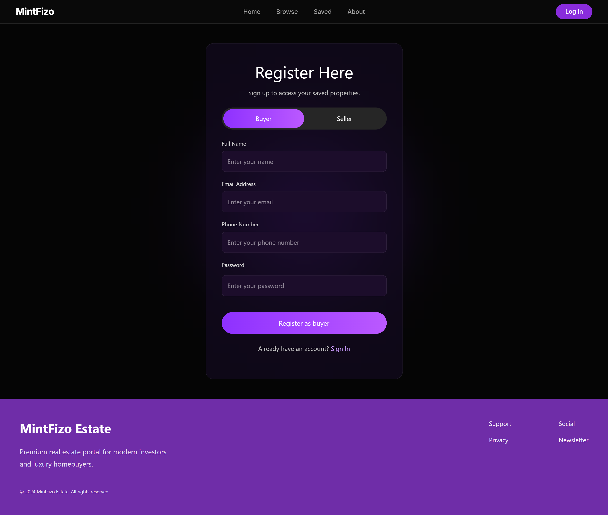
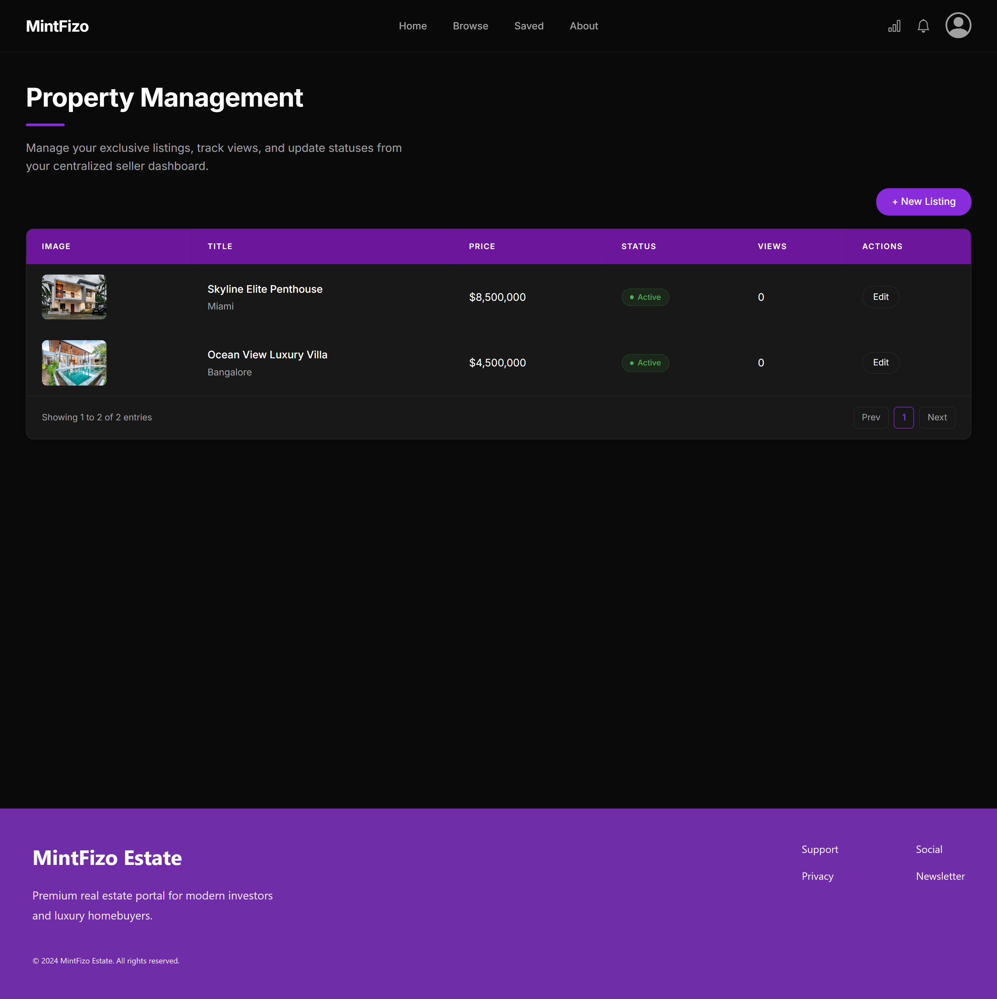
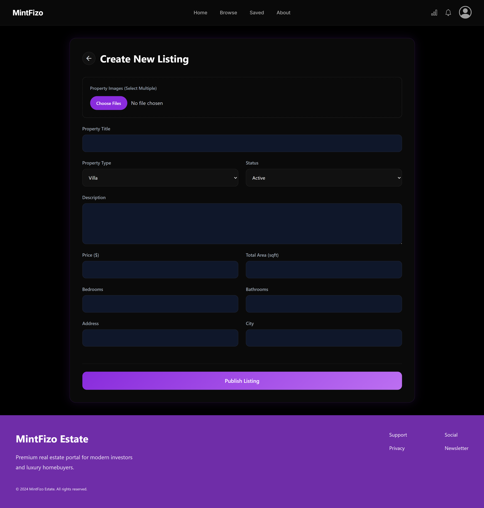
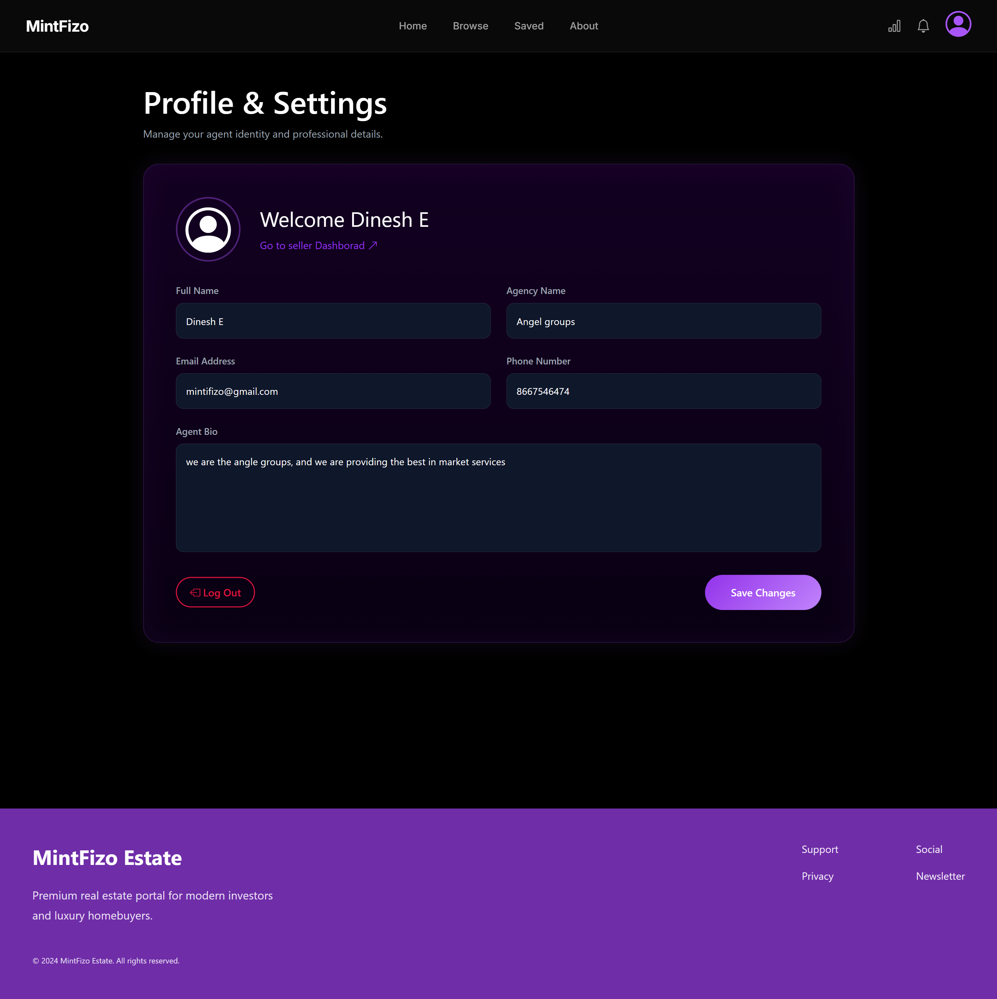
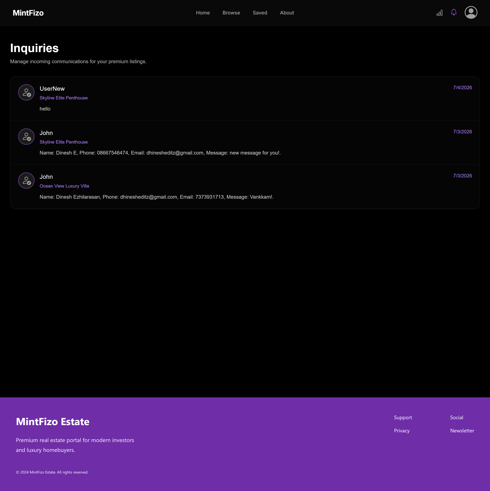
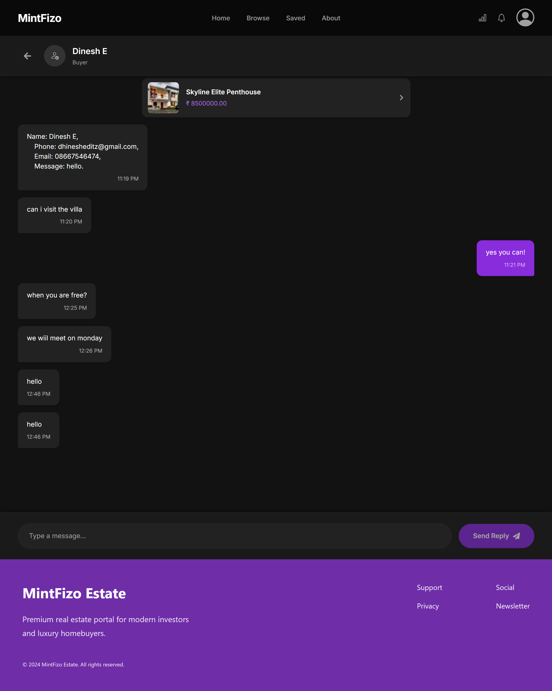

# MintFizo Estate - Ultra-Luxury Real Estate Platform

MintFizo Estate is a full-stack SaaS property management platform designed for ultra-luxury real estate portfolios. The application features a secure role-based ecosystem (Buyers and Sellers), a centralized management dashboard with advanced multipart/form-data media handling, a dedicated messaging system, and a beautifully curated public storefront.

## 🚀 Tech Stack

### Frontend
- **React.js** (Vite)
- **Bootstrap CSS** & Custom External CSS
- **React Router Dom** (SPA Routing & Protected Routes)
- **Axios** (API Client)
- **React Icons**

### Backend
- **Django** & **Django REST Framework (DRF)**
- **PostgreSQL** (Production Database)
- **SimpleJWT** (JSON Web Token Authentication)
- **Pillow** (Media File Processing)

---

## ✨ Key Features

- **Secure Role-Based Authentication:** Custom JWT implementation attaching persistent user profiles (`Buyer` vs `Seller`) to control dashboard access permissions.
- **Protected Routing:** Clientside route guards ensuring only authenticated sellers can access resource-creation views.
- **Dynamic Portfolios:** Automated price shrink formatting (e.g., `$12.5M`) and fallback image management via data-driven state pipelines.
- **Multipart Media Upload Pipeline:** Multi-file upload stream via native browser `FormData` mapped directly onto sequential nested relational database fields.
- **Public Storefront:** Unauthenticated conditional reading (`IsAuthenticatedOrReadOnly`) filtering active assets for prospective buyers.
- **Direct Buyer-Seller Messaging:** Integrated communication hub allowing prospective buyers to message sellers directly regarding specific properties, complete with chat history and contextual property linking.
- **Seller Profile Management:** Dedicated settings interface for agents to manage their public identity, agency details, and professional bio seamlessly.

---

## 📸 Application Gallery

Here is a look at the MintFizo Estate platform in action:

### 1. Public Storefront (Home)

*The unauthenticated public landing page featuring an interactive search engine and dynamic luxury real estate grid.*

### 2. Account Registration (Signup)

*Secure role-based onboarding where users choose to join the platform as a prospective buyer or an exclusive seller.*

### 3. Seller Dashboard

*The centralized, role-protected management hub where verified sellers track, edit, and oversee their entire property portfolio.*

### 4. Property Creation (New Listing)

*A comprehensive multipart form allowing sellers to upload rich property details, set pricing, and manage high-resolution image galleries.*

### 5. Immersive Property Showcase (The "Zillow" View)

*The high-converting buyer deep-dive page, featuring an expanded image gallery, full estate specifications, and a direct negotiation trigger.*

### 6. Seller Profile Management

*A dedicated settings page where agents can update their professional identity, contact details, and agency bio.*

### 7. Inquiries Inbox

*A centralized inbox for sellers to track and manage incoming buyer interests and viewing requests across all their active listings.*

### 8. Direct Communication Hub

*A seamless messaging interface connecting buyers and sellers directly, featuring contextual property details and threaded chat history.*

---

## 📂 Project Structure

```text
Property-managment-project/
│
├── obsidian_backend/          # Django Backend
│   ├── obsidian_backend/      # Project Configuration
│   ├── properties/            # Core Application (Models, Views, Serializers)
│   ├── media/                 # Uploaded Property Images
│   └── manage.py
│
└── obsidian_frontend/         # React Frontend
    ├── src/
    │   ├── components/        # Reusable Elements (ProtectedRoute, Navbar)
    │   ├── pages/             # App Views (Home, Login, Register, Dashboard, AddProperty, Communication, etc.)
    │   ├── App.jsx            # Routing & Application Layout
    │   └── style.css          # Centralized Global Custom Styles
    └── package.json