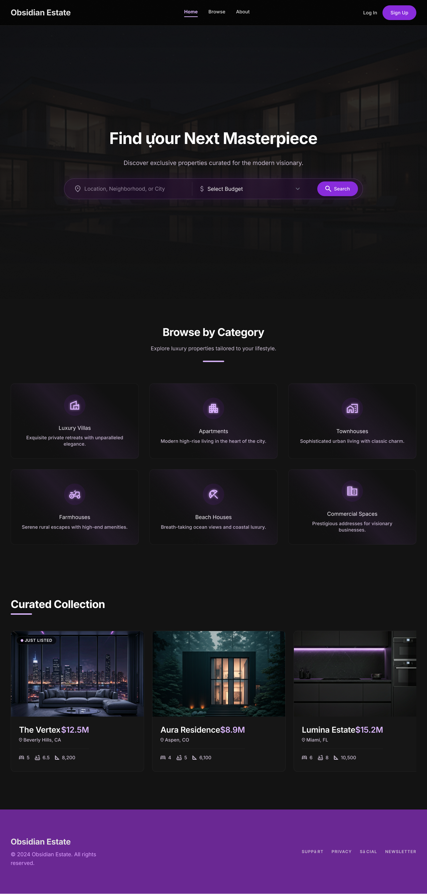
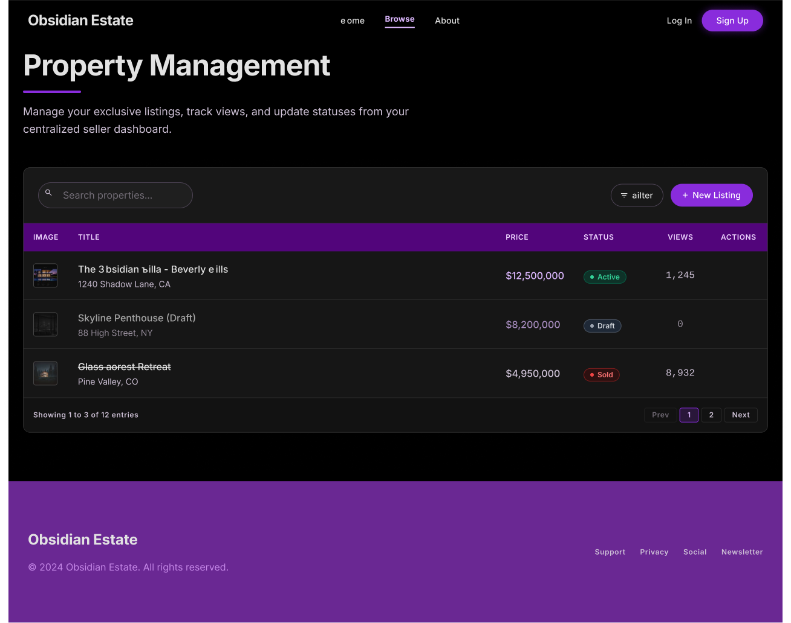
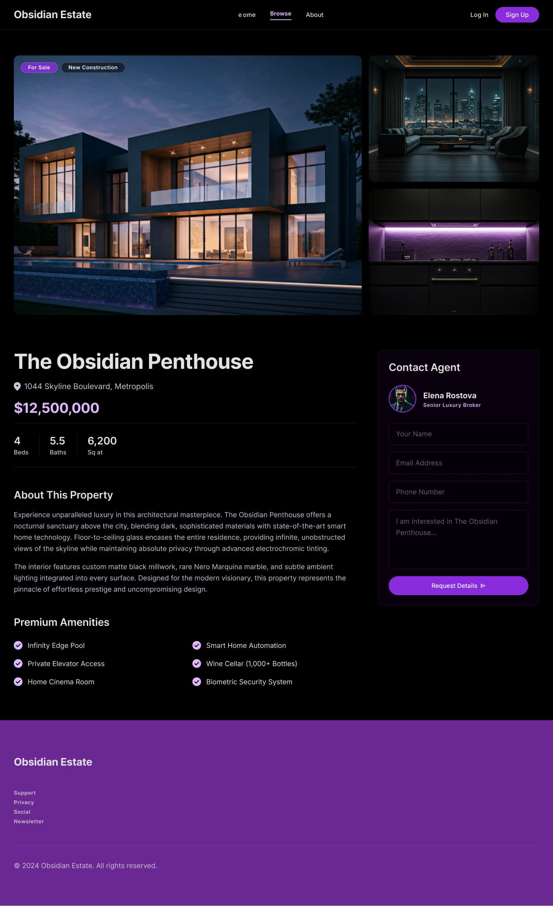
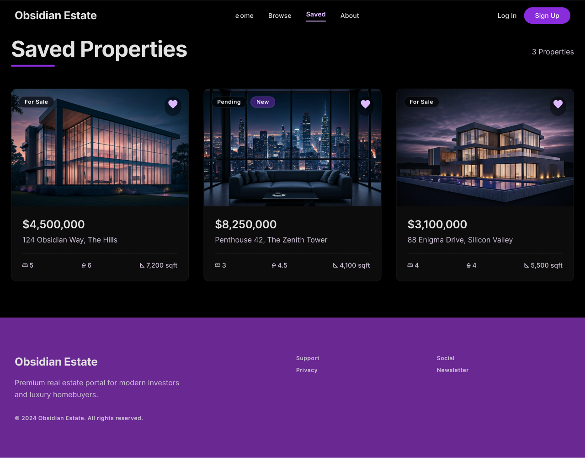

# Obsidian Estate - Ultra-Luxury Real Estate Platform

Obsidian Estate is a full-stack SaaS property management platform designed for ultra-luxury real estate portfolios. The application features a secure role-based ecosystem (Buyers and Sellers), a centralized management dashboard with advanced multipart/form-data media handling, and a beautifully curated public storefront.

## 🚀 Tech Stack

### Frontend
- **React.js** (Vite)
- **Tailwind CSS** & Custom External CSS
- **React Router Dom** (SPA Routing & Protected Routes)
- **Axios** (API Client)
- **React Icons**

### Backend
- **Django** & **Django REST Framework (DRF)**
- **PostgreSQL** (Production Database)
- **SimpleJWT** (JSON Web Token Authentication)
- **Pillow** (Media File Processing)

---

## ✨ Key Features

- **Secure Role-Based Authentication:** Custom JWT implementation attaching persistent user profiles (`Buyer` vs `Seller`) to control dashboard access permissions.
- **Protected Routing:** Clientside route guards ensuring only authenticated sellers can access resource-creation views.
- **Dynamic Portfolios:** Automated price shrink formatting (e.g., `$12.5M`) and fallback image management via data-driven state pipelines.
- **Multipart Media Upload Pipeline:** Multi-file upload stream via native browser `FormData` mapped directly onto sequential nested relational database fields.
- **Public Storefront:** Unauthenticated conditional reading (`IsAuthenticatedOrReadOnly`) filtering active assets for prospective buyers.

---

## 📸 Application Gallery

Here is a look at the Obsidian Estate platform in action:

### 1. Public Storefront (Home)

*The unauthenticated public landing page featuring an interactive search engine and dynamic luxury real estate grid.*

### 2. Seller Dashboard

*The centralized, role-protected management hub where verified sellers track, edit, and upload their portfolios.*

### 4. Immersive Property Showcase (The "Zillow" View)

*The high-converting buyer deep-dive page, featuring an expanded image gallery, full estate specifications, and a direct negotiation trigger.*

### 5. Buyer's Private Shortlist (Saved Properties)

*A personalized buyer hub where favorited luxury estates are stored for quick comparison and status tracking.*

> **Note:** To replace these placeholders with your actual screenshots, take a screenshot of your app, save them in a folder called `assets` in your GitHub repo, and change the URL in the markdown to `assets/home-page.png`, etc.

---

## 📂 Project Structure

```text
Property-managment-project/
│
├── obsidian_backend/          # Django Backend
│   ├── obsidian_backend/      # Project Configuration
│   ├── properties/            # Core Application (Models, Views, Serializers)
│   ├── media/                 # Uploaded Property Images
│   └── manage.py
│
└── obsidian_frontend/         # React Frontend
    ├── src/
    │   ├── components/        # Reusable Elements (ProtectedRoute, Navbar)
    │   ├── pages/             # App Views (Home, Login, Register, Dashboard, AddProperty)
    │   ├── App.jsx            # Routing & Application Layout
    │   └── style.css          # Centralized Global Custom Styles
    └── package.json